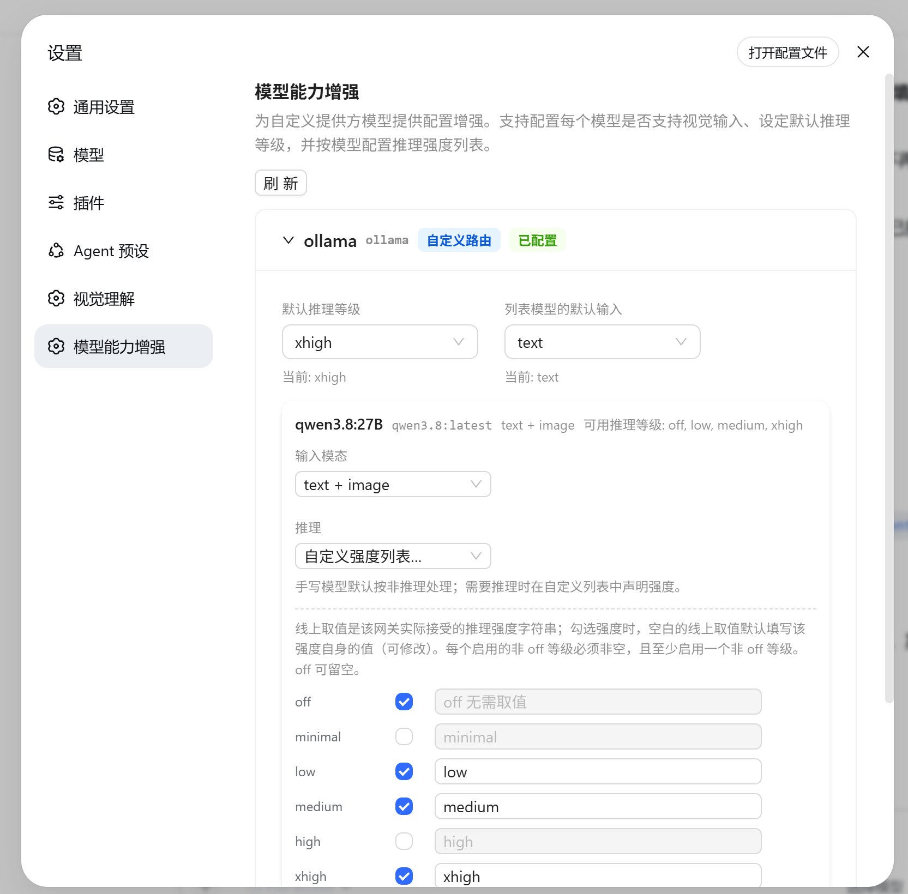
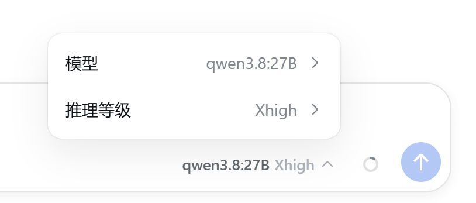

# dsh-model-capability-enhancement

在 dsh 的「设置」对话框中新增 **模型能力** 分区，为 **llm-pi-ai 自定义提供方**（`settings.yaml` 里手写声明的路由，如 `ollma-local`）开放三组**配置文件已支持但「模型」页未开放**的字段：

| 字段 | 位置 | 说明 |
| --- | --- | --- |
| `input` | 每个模型 | 声明该模型接受的输入模态：`['text']` / `['text','image']`（视觉模型）。未设置时回退到目录基线（目录路由）或提供方默认。 |
| `reasoning` | 提供方 | 默认推理等级（`off / minimal / low / medium / high / xhigh / max`）。请求未显式指定强度时使用；提供方不支持时会拒绝请求。 |
| `reasoningEfforts` | 每个模型 | 推理强度 → 线上取值 的映射：`false` = 非推理模型；省略 = 按非推理处理；字典 = 每个启用的等级给出网关实际接受的 wire 字符串（`off` 可为 `null`，至少启用一个非 off 等级）。 |

页面只展示**手写声明的自定义路由**（`declared === true`），pi-ai 内置目录路由与官方 DeepSeek 路由不在本页。

## 效果展示





上方为提供方级配置（刷新、默认推理等级、列表模型的默认输入），下方为按模型的输入模态与推理强度映射勾选列表。

## 架构

- **Host 半**（`src/index.ts` + `src/routes.ts`）：注册两条同源 JSON 路由
  - `GET  /dsh-model-capability-enhancement/view` — 经 settings/llm seam 读取视图 + 写入事实（writable / revision）；
  - `POST /dsh-model-capability-enhancement/apply` — 持久化编辑，走 `settings.mutate`（`llm-pi-ai` 命名空间）并带 `expectedRevision` 冲突防护。未改动的字段传 `KEEP`，用户复位传 `REVERT`（删除 key）。
- **Client 半**（`src/client/`）：注册 `settings.section`（id `model-capability`，order 20）
  - 基于 **Ant Design v6**（CSS-in-JS，样式随组件按需注入）；JS 侧用 antd 官方按需子路径导入（`antd/es/xxx`），构建时由 rolldown tree-shake 只打包实际用到的组件（bundle ≈ 315 KB gzip，未打包 calendar/date-picker 等未用组件）；
  - `ConfigProvider` 通过注入的 `colorScheme` 观察器跟随 dsh 亮/暗主题（`defaultAlgorithm` / `darkAlgorithm`）；
  - 应用更改后经 `App.useApp()` 的 `message` 弹出 toast（成功绿色 / 冲突 warning / 拒绝 error），校验失败也在 toast 中提示。
  - UI 交互：下拉列表现选中项以组件库 `CheckOutlined` 对勾图标标记；每个提供方卡片**默认收起**，点击卡片标题展开/收起（收起时标题行显示模型数量）；「刷新」按钮位于分区顶部，全局刷新所有提供方的最新模型配置列表——刷新时按钮内置 loading 效果，刷新成功后 toast 提示「刷新成功」。

## 构建

```sh
pnpm install
pnpm build
```

产物：`lib/index.mjs`（Node half）+ `lib/client.js`（浏览器 half，`__ModuleLoader__` 包裹）。

## 安装到 dsh profile

```sh
pnpm dsh plugin --profile <name> add <本目录>
```

或临时挂载（`--patch`，需把 `name` 改成绝对路径 file:// URL）：

```sh
pnpm dsh web --patch file:///D:/workspace/lemy/dsh-plugins/dsh-model-capability-enhancement/cordis.patch.yml
```

## 写入落点（llm-pi-ai 设置节）

- 提供方默认等级：`llm-pi-ai.providers.<id>.reasoning`
- 列表模型的默认输入（仅当路由已有 models 列表时可用）：`llm-pi-ai.providers.<id>.defaultInput`
- 已声明路由的模型能力：`llm-pi-ai.providers.<id>.models[i].{input, reasoningEfforts}`
- 目录路由（本页不展示，逻辑保留）：`llm-pi-ai.providers.<id>.modelOverrides.<modelId>`

所有写入先过 settings validator（`reasoningEfforts` 的结构/取值校验），失败不落盘；revision 冲突返回 `conflict`。
